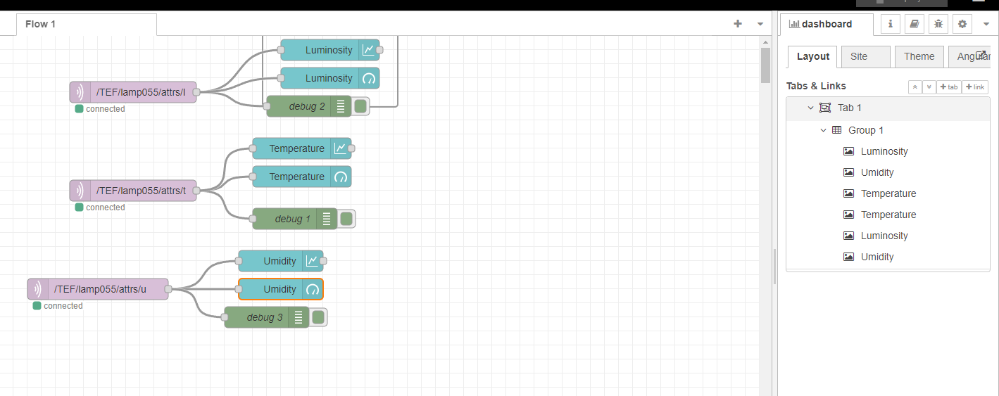

## Projeto: Controle de LED e Monitoramento de Temperatura e Umidade com ESP32
### Descrição
Este projeto utiliza um microcontrolador ESP32 para controlar um LED onboard e monitorar a temperatura e a umidade ambiente com um sensor DHT11. Os dados são enviados para um broker MQTT, permitindo o controle remoto e a visualização das informações em tempo real.
 
### Funcionalidades
- Controle do LED: O LED onboard pode ser ligado e desligado via comandos MQTT.
- Leitura de Sensor DHT11: Monitora a temperatura e a umidade, publicando os dados em tópicos específicos do broker MQTT.
- Leitura de Luminosidade: Captura o nível de luminosidade através de um pino analógico e publica o valor.
- Conexão Wi-Fi: Conecta-se a uma rede Wi-Fi para comunicação com o broker MQTT.
### Requisitos
#### Hardware:
- ESP32
Sensor DHT11
Resistência (se necessário, dependendo do circuito)
#### Software:
- IDE Arduino com suporte para ESP32
#### Bibliotecas:
- WiFi.h
- PubSubClient.h
- Adafruit_Sensor.h
- DHT.h
- DHT_U.h
- Configuração
## Instalação de Bibliotecas:
 
No Arduino IDE, instale as bibliotecas necessárias através do Gerenciador de Bibliotecas.
#### Configuração de Credenciais:
 
Edite as constantes default_SSID, default_PASSWORD e default_BROKER_MQTT com suas credenciais de Wi-Fi e informações do broker MQTT.
#### Conexão do Hardware:
 
- Conecte o sensor DHT11 ao pino 4 do ESP32.
- Conecte o LED onboard ao pino designado (D4).
### Execução
- Abra o código no Arduino IDE.
- Selecione a placa ESP32 correta e a porta serial.
- Carregue o código no microcontrolador.
- Abra o monitor serial para visualizar as informações de conexão e dados do sensor.
### Estrutura do Código
- setup(): Inicializa componentes, conecta ao Wi-Fi e ao broker MQTT, e configura o sensor DHT11.
- loop(): Verifica conexões, lê dados dos sensores, e publica as informações no broker MQTT.
- mqtt_callback(): Lida com mensagens recebidas para controlar o LED.
### Tópicos MQTT
- Tópico de Comando: /TEF/lamp055/cmd (para receber comandos de controle do LED)
- Tópico de Estado do LED: /TEF/lamp055/attrs (publica o estado do LED)
- Tópico de Temperatura: /TEF/lamp055/attrs/t (publica a temperatura)
- Tópico de Umidade: /TEF/lamp055/attrs/u (publica a umidade)
- Tópico de Luminosidade: /TEF/lamp055/attrs/l (publica a luminosidade)

###Node-Red

Instale o Node-red diretamente do site deles, após isso, inicie o servidor do mesmo e entre no seu ip local (normalmente se usa localhost:1880)

Efetue essa configuração no node-red após inicia-lo

após isso, clique para visualizar o dashboard no canto superior direito, uma nova aba ira abrir com esse retorno 

